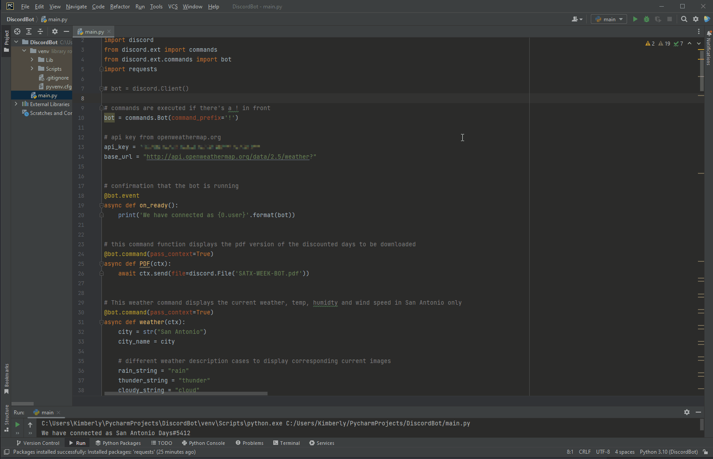
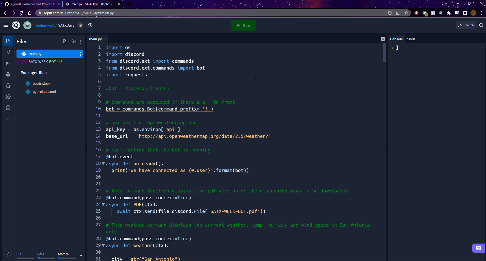

# discord-Bot-Project-1

I got inspiration to create a discord bot for a discord server I'm in, which is primarily about events, social talk, traveling and questions about the city.
Thus this bot was made with that discord server in mind. The bot responds and messages/displays info for the current available commands for example:
- A weekly view of discounted places to go and things to do in the city
- A view of discounted places on a specific day
- The weather and revalant data of the city or any chosen city

The available discounted places and things to do in the city is frequently asked by those in the discord server for those who are vistiting, moving to, or residents looking for things to do for holidays, weekends and vacation days. As a result, I also thought it would be a good idea to add a weather command to the bot for those checking how the weather would be for the day or week they think about going to places or things to do on those discounted days. Thus the bot responds to those requesting the current weather in the city or any other city. 

Below is a view of how the bot responds to the commands in a server.

## [Python file](https://github.com/kgonz038/discord-Bot-Project-1/blob/main/main.py)

- Notes: You need the bot's key which is given when it's created and to be sure it's NOT publicly shown or else others can mess with your bot. The same goes with the weather API key. The weather API key is available for [free](https://openweathermap.org/). A way I hid this while working on it on a public python IDE was on [replit](https://replit.com) using the Secrets System environment variables to hide bot's key (TOKEN) and the weather API (api). This is shown below. Although you are able to comfortable bypass hiding the api and key if you're working on the bot in a non-public project file on a computer program IDE like PyCharm. I also worked on the bot on PyCharm for experience and you don't need to hide the API and key. All you need to do is add it as simpley 'API here' or 'key here'. Yet you need to still not share these with others.

